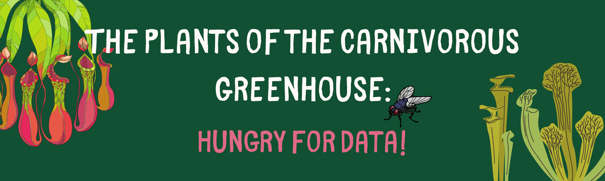

# Carnivorous Plant Greenhouse Monitoring System

A full-stack IoT solution for monitoring and maintaining the health of carnivorous plants in a greenhouse environment. This system uses a network of sensors and cameras with a dual Raspberry Pi setup to collect data, analyze plant health, and provide actionable insights.

## System Architecture

### Hardware Components

#### Raspberry Pi Setup
- **plant-hub**: Central server that collects, stores, and visualizes data
  - Runs Docker containers for data storage, analysis, and visualization
  - Hosts the web interface for monitoring plant health
  
- **plant**: Sensor hub that collects environmental data
  - Connected to physical sensors via I2C
  - Transmits data to plant-hub for processing and storage

#### Sensors
- **SHT-30 Temperature & Humidity Sensor**: Weather-proof sensor for accurate climate monitoring
- **Ambient Light Sensor (0-200klx)**: Monitors light levels in the greenhouse *(planned implementation)*
- **Web Camera**: Used for visual plant health assessments via the plant-doctor AI

#### Optional Hardware
- **Smart Plug for Humidifier**: Controllable via Node-RED to maintain optimal humidity levels

### Software Components

- **sensor-reader**: Python application running on the "plant" Raspberry Pi that reads sensor data and sends it to the plant-hub
- **plant-doctor**: AI-powered visual analysis tool using OpenAI's GPT-4 Vision to assess plant health from camera images
- **Grafana**: Data visualization and dashboard for monitoring environmental conditions
- **Prometheus**: Time-series database for storing metrics
- **Loki**: Log aggregation service
- **Node-RED**: Flow-based programming tool for automation and alerts
- **Alloy**: Observability data pipeline

## Setup Instructions

### Plant-Hub Setup (Raspberry Pi #1)

1. **Prerequisites**
   Install Docker and Docker Compose on the Raspberry Pi: https://docs.docker.com/engine/install/debian/


2. **Clone the Repository**
   ```bash
   git clone https://github.com/username/carnivorous-plant-health.git
   cd carnivorous-plant-health
   ```

3. **Start the Services**
   ```bash
   docker-compose up -d
   ```

4. **Access the Services**
   - Grafana: http://plant-hub:3000
   - Node-RED: http://plant-hub:1880
   - Prometheus: http://plant-hub:9090

### Plant Sensor Hub Setup (Raspberry Pi #2)

1. **Prerequisites**
   ```bash
   sudo apt update && sudo apt upgrade -y
   sudo apt install -y python3-pip python3-venv git i2c-tools
   ```

2. **Enable I2C Interface**
   ```bash
   sudo raspi-config
   # Navigate to Interface Options > I2C > Enable
   ```

3. **Clone the Repository**
   ```bash
   git clone https://github.com/username/carnivorous-plant-health.git
   cd carnivorous-plant-health/sensor-reader
   ```

4. **Install the Sensor Reader Service**
   ```bash
   sudo ./install.sh
   ```

5. **Verify Installation**
   ```bash
   sudo systemctl status greenhouse-sensor
   ```

### Sensor Wiring

#### SHT-30 Temperature & Humidity Sensor
- Connect VIN to 3.3V
- Connect GND to GND
- Connect SCL to SCL (GPIO 3)
- Connect SDA to SDA (GPIO 2)

#### Ambient Light Sensor (Optional will need to enable pins for general use)
- Connect VCC to 3.3V
- Connect GND to GND
- Connect SCL to SCL (GPIO 27)
- Connect SDA to SDA (GPIO 28)

### Web Camera Setup

1. **Connect the USB webcam to Plant Raspberry Pi**

2. **Install the Plant Doctor Service**
   ```bash
   cd carnivorous-plant-health/plant-doctor
   pip install -r requirements.txt
   ```

3. **Set up OpenAI API Key**
   ```bash
   export OPENAI_API_KEY=your-api-key
   ```

4. **Setup the Plant Doctor Application**
   ```bash
   sudo ./install.sh
   ```

## System Features

### Environmental Monitoring
- Real-time temperature and humidity tracking
- Light level monitoring (planned implementation)
- Historical data visualization and trends
- Alert thresholds for critical conditions

### Plant Health Analysis
- AI-powered visual assessment of plant health
- Identification of potential issues or diseases
- Carnivorous plant species recognition
- Health status tracking over time

### Automation
- Smart humidifier control based on humidity levels
- Alert notifications for adverse conditions
- Scheduled image capture and health assessment

## Dashboard Guide

The Grafana dashboard at http://plant-hub:3000 provides:

- Current temperature and humidity readings
- Historical trends of environmental conditions
- Alert status and history
- Plant health assessment results

## Troubleshooting

### Sensor Issues
- Verify I2C connection: `sudo i2cdetect -y 1`
- Check system logs: `journalctl -u greenhouse-sensor -f`
- Ensure proper wiring and power supply

### Camera Issues
- Verify camera connection: `ls -l /dev/video*`
- Test camera capture: `fswebcam test.jpg`

### Connectivity Issues
- Ensure both Raspberry Pis are on the same network
- Verify network configuration: `ping plant-hub` from the sensor Pi
- Check service status: `docker-compose ps` on the hub Pi

## Contributing

Contributions to this project are welcome! Please submit pull requests or open issues for bugs, feature requests, or improvements.

## License

This project is licensed under the MIT License - see the LICENSE file for details.

